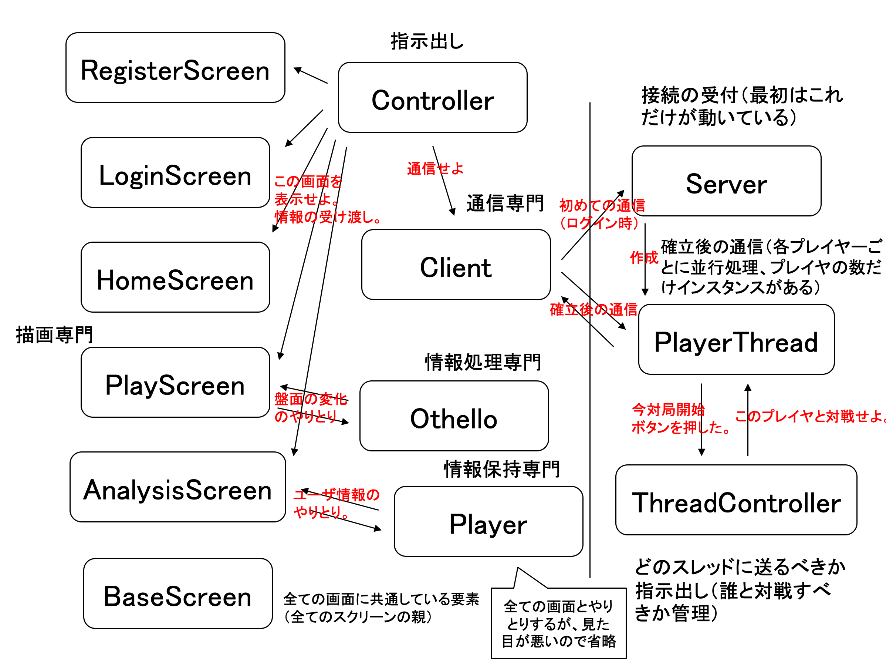
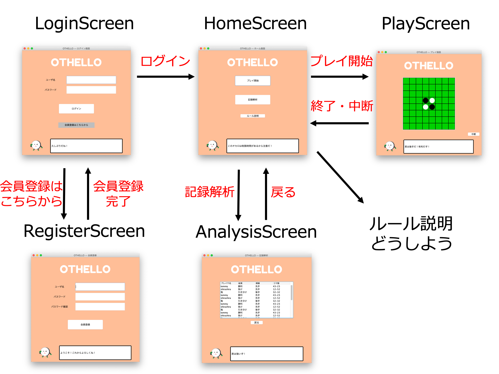

# githubとは

## githubの本質
githubの本質を一言でいうなら、「バージョン管理を楽にするソフトウェア」です。

色々なソースコードやファイルを複数人で開発していると、下のような作業が必要となります。（開発を楽に進めるため）

* 誰が何をいつ更新したのか、を誰かが整理する必要がある
* ファイルのアーカイブ（=過去のファイル・バージョンの古いファイル）を誰かが管理する必要がある
* 複数人が、あるファイルをそれぞれ修正したとき、誰かがそれらを１つのファイルにまとめあげる必要がある

これらの作業を楽にする（=バージョン管理を楽にする）のがgithubです。

* ファイルの管理者を決めてその人が交通整理をしよう
* 自動でできることは勝手にやっちゃおう

という考えで解決しています。

## githubの仕組み・使い方
こちらを参照してください。
https://backlog.com/ja/git-tutorial/?gclid=Cj0KCQjw7sDlBRC9ARIsAD-pDFrCzUt0nhg9p93EfELwDQBkjRUpKXE0k4hZIYR4rSVCtW5a4pxKo2IaAumPEALw_wcB

# 全体像

全体像


遷移図


# 参考
* とりあえずgithubをeclipseで使うために(始めの方は飛ばして「Eclipseでリポジトリをクローン」の節から読む) -> https://www.gwtcenter.com/using-github-in-eclipse
* サーバのクラスの参考 -> https://www.techscore.com/tech/Java/JavaSE/Network/3-2/

# ソースコードの説明
## Controller.java
* プログラムの起動(main関数)
* 画面遷移処理(actionPerformed関数)
* Clientクラスにサーバへの接続確立を依頼(establishConnection関数)
* Clientクラスにサーバへの情報送信を依頼(sendMessage関数)

## BaseScreen.java
* 抽象クラス(=これだけではインスタンス化できない・継承されることを前提としている)
* 描画専門
* タイトル画像の描画(topPanel)
* アイコン・コメントの描画(bottomPanel)

## xxxScreen.java
* 描画専門
* BaseScreenを継承
* BaseScreen以外のログイン画面要素を描画

## PlayScreen.java
* 上の描画に加えて...
* 盤面の情報(pieces[][] -> 0:駒なし, 1: 黒, 2: 白)
* 駒を置けるか置けないかの情報(puttable[][] -> 0: 置けない, 1: 置ける)
* othelloに処理を依頼(actionPerformed関数内で、controller.sendMessage関数, othello.getNextBorder関数を呼ぶ)

## Othello.java
* 次の盤面の状況を調べる(getNextBorder関数 pieces[][]とputtable[][]を更新)

## Client.java
* サーバに接続(establishConnection関数)
* サーバへ情報送信(sendMessage関数)

# 補足説明
## ボタンが押された時に呼ばれる関数
* 基本的にController.javaのactionPerformedが呼ばれ、あらかじめ設定したactionCommandという名前でどのボタンが押されたか判断
* オセロの盤面のボタンが押されたら、PlayScreen.javaのactionPerformedが呼ばれ、othelloに処理を依頼

## メッセージの形式
JSON形式(ジェイソン形式)
* {"キー": "値", "キー": "値"}の形で記述されているテキストファイル
* typeでどのメッセージか判断してもらうことを想定
* 下の例は見やすさのため改行を入れているが、本当に送信するときは改行しない想定（readLine()で１つのJSONデータを読み込むことができるように)

ログイン時

client to server
```
{
    "type": "login",
    "username": "xxx",
    "password": "xxx"
}
```
server to client
```
{
    "type": "login",
    "status": "succeess" または "invalid username" または "invalid password" または "unknown error"
}
```

会員登録時

client to server
```
{
    "type": "register",
    "username": "xxx",
    "password": "xxx"
}
```
server to client
```
{
    "type": "login",
    "status": "succeess" または "invalid username" または "unknown error"
}
```

対局開始

client to server
```
{
    "type": "play start"
}
```
server to client
```
{
    "type": "play start",
    "move": "first" または "passive",
    "opponent": "xxx",
    "status": "succeess" または "unknown error"
}
```

操作の情報

client to server
```
{
    "type": "put",
    "put": "行数,列数" (例えば "0,4"),
    "pieces": "黒の駒数,白の駒数" (例えば "31, 19")
}
```
server to client
```
{
    "type": "put",
    "status": "succeess" または "unknown error"
}
```


## 一般的な補足
* PC画面一杯で見きれないような関数は良くない -> 機能ごとに分割するべき(上に書いてない関数でもバンバン作ってください)
* 変数の命名は、長くなってもいいので省略をせずに一意に特定できる名前にするべき

## images
使用する画像フォルダ

## othelloScreen
~~オセロスクリーンパッケージ。import othelloScreen.\*;をすることで、このパッケージ内のクラスを使用することができる。現に、Controller.javaではインポートしている。~~
諸事情あってやめました。

# スケジュール感
* GW明けるまでに基本的な処理のコーディングを終わらせる
* GW以降はデザインや音などのUIを改良・暗号化処理
